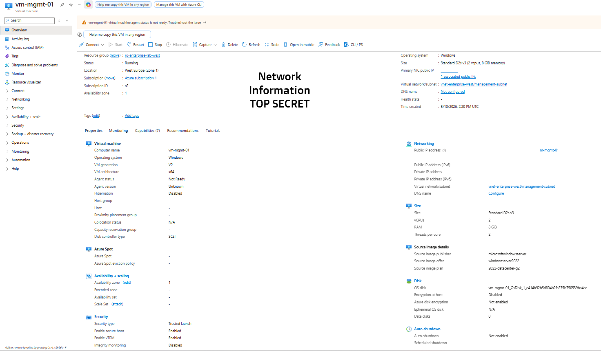
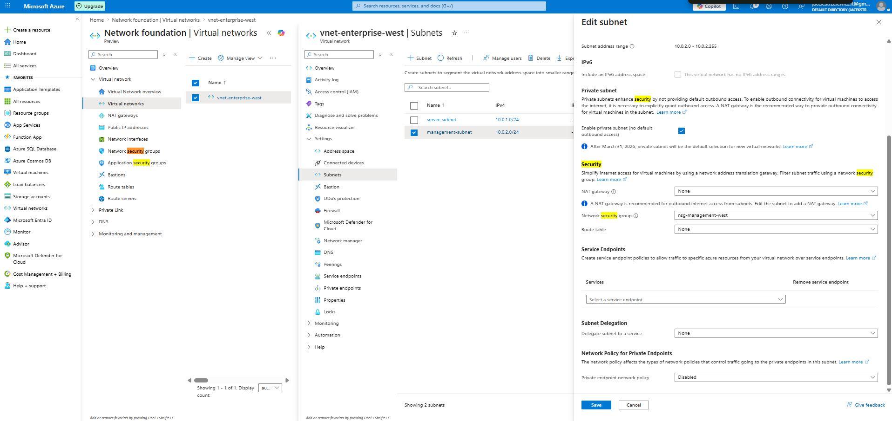

# Azure Windows Server Infrastructure Lab

## Project Overview

This project demonstrates the deployment and configuration of a secure Microsoft Azure infrastructure environment using Windows Server 2022. The lab focuses on virtual networking, subnet segmentation, Network Security Groups (NSGs), and secure Remote Desktop Protocol (RDP) administration practices.

The environment was designed to simulate basic enterprise infrastructure and security concepts commonly used in cloud administration and infrastructure engineering roles.

---

# Technologies Used

* Microsoft Azure
* Windows Server 2022
* Azure Virtual Network (VNet)
* Subnet Segmentation
* Network Security Groups (NSGs)
* Remote Desktop Protocol (RDP)

---

# Infrastructure Configuration

## 1. Virtual Network and Subnet Segmentation

I separated management and server traffic into dedicated subnets to simulate enterprise network segmentation.

### Key Components

* management-subnet
* server-subnet
* Azure Virtual Network

---

## 2. Windows Server 2022 Deployment

Deployed a Windows Server 2022 virtual machine in Microsoft Azure (West Europe region) as part of an AZ-104 lab environment.

Configured:

* compute resources
* networking
* public IP address
* remote administration access via RDP

---

## 3. NSG Security Configuration

### Management Subnet Security

Implemented management-subnet-level network segmentation using a dedicated Network Security Group to control inbound RDP access based on source IP restrictions.

### Server Subnet Security

Implemented subnet-level security controls for the server-subnet using a dedicated Network Security Group to isolate production resources and manage inbound traffic according to least privilege principles.

---

## 4. Secure RDP Access

Restricted Remote Desktop Protocol (RDP) access only to my trusted public IP address to improve security and reduce external attack surface exposure.

This configuration demonstrates:

* basic least privilege access control
* secure remote administration
* inbound traffic filtering using NSGs

---

## 5. VM Networking Configuration

Displayed the networking configuration of the virtual machine, including:

* subnet association
* network interface configuration
* inbound port configuration for RDP access

This validates secure network segmentation within the Azure virtual network environment.

---

## 6. Remote Administration Validation

Established a successful Remote Desktop Protocol (RDP) session to the Azure virtual machine, confirming:

* successful network connectivity
* proper NSG configuration
* secure inbound access restrictions

---

# Deployment Screenshots

## 1. Windows Server 2022 Deployment

---

## 2. Virtual Network and Subnet Segmentation

---

## 3. VM Deployment

---

## 4. VM Networking Configuration

---

## 5. NSG Management Subnet Configuration

---

## 6. Secure RDP Rule

---

## 7. Successful RDP Session

---

# Skills Demonstrated

* Azure Infrastructure Deployment
* Windows Server Administration
* Azure Networking
* Virtual Network Segmentation
* Network Security Group Configuration
* Secure Remote Access
* Basic Cloud Security Practices
* Infrastructure Troubleshooting

---

# Learning Objectives

This lab was created to practice:

* Azure infrastructure deployment
* subnet segmentation
* NSG administration
* secure RDP access configuration
* Windows Server remote administration

---

# Author

Created as part of a personal Azure and Windows Server infrastructure lab environment for cloud administration and infrastructure engineering practice.
